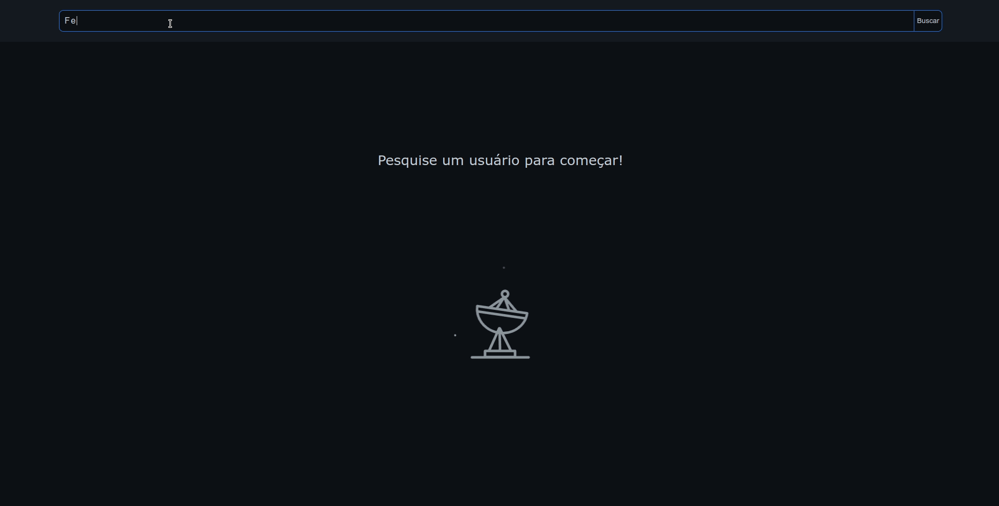

# Github Search

<br>
 
<div align="center">


 </div>

<br>

## Tabela de Conteúdos

- [Sobre](#about)
- [Instalação](#getting_started)
- [Usage](#usage)
- [Ferramentas](#tools)

<br>

 ## Sobre o Projeto <a name = "about"></a>

Aplicação que através do consumo da API pública do Github realiza a busca de um usuário desejado e retorna o perfil e repositórios deste. Desenvolvido para o bootcamp Dio.me.

<br>
 
## Iniciando Localmente <a name = "getting_started"></a>

### Download <a name = "download"></a>
```bash
git clone https://github.com/FelipeJozala/github-search.git
```
ou faça o download do repositório:  [Github Search (ZIP)](https://github.com/FelipeJozala/github-search/archive/refs/heads/master.zip)
 
<br>
 
### Entre no diretório do projeto:
```bash
cd github-search
```
### Instale as dependências
```bash
npm install
```
### Inicie a aplicação
```bash
npm start
```
o App estará disponível em `localhost:3000`

## Ferramentas utilizadas <a name = "tools"></a>
 
- [React](https://pt-br.reactjs.org/)
- [Styled Components](https://styled-components.com/)
- [Axios](https://axios-http.com/docs/intro)
- [Lottie](https://lottiefiles.com/)

### Dev Dependencies

- [Eslint](https://eslint.org/) 
- [EditorConfig](https://editorconfig.org/)

<br>